<!-- START doctoc generated TOC please keep comment here to allow auto update -->
<!-- DON'T EDIT THIS SECTION, INSTEAD RE-RUN doctoc TO UPDATE -->
**Table of Contents** *generated with [DocToc](https://github.com/thlorenz/doctoc)*

- [Buzzword Bingo: Player & Organizer Guide](#buzzword-bingo-player--organizer-guide)
  - [Creating a game](#creating-a-game)
  - [Sharing it](#sharing-it)
  - [Joining a game](#joining-a-game)
  - [Playing](#playing)
  - [Winning](#winning)
  - [Dark mode](#dark-mode)
  - [On your phone](#on-your-phone)
  - [When something's not right](#when-somethings-not-right)

<!-- END doctoc generated TOC please keep comment here to allow auto update -->

# Buzzword Bingo: Player & Organizer Guide

Buzzword Bingo turns a talk, meeting, or webinar into a game: an organizer creates a board of buzzwords, shares one link, and everyone plays along on their phone — marking a square every time they hear a word, until someone completes a row, column, or diagonal.

No accounts, no sign-up, no app to install.
Everything runs in your browser.

## Creating a game

Open the home page and give your game a name — the game name field is focused automatically, so on mobile you can start typing right away, and pressing Enter submits the form just like tapping the button.

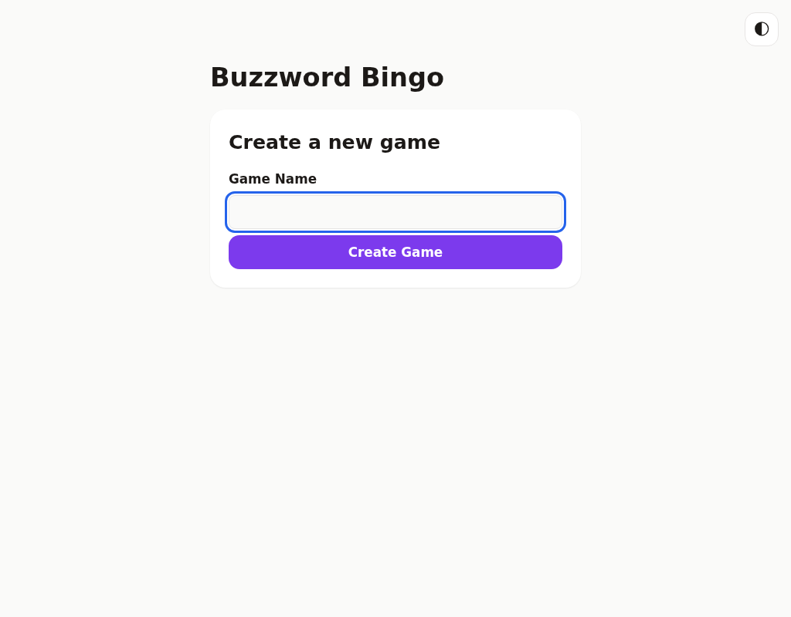

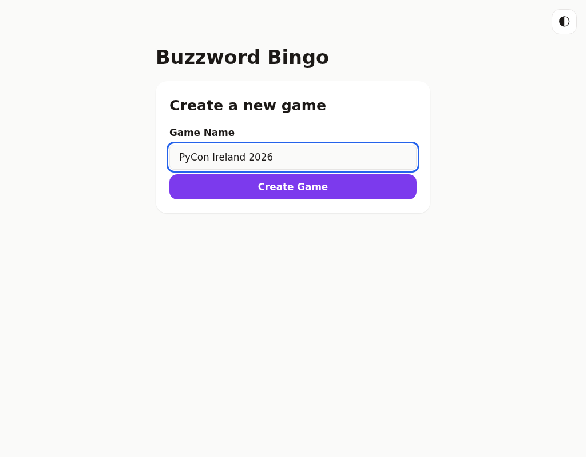

## Sharing it

Once you create the game, you'll land on a confirmation screen with a link to share with your players — over chat, on a slide, or however you'd share any link.
Tap **Copy Link** to copy it to your clipboard.

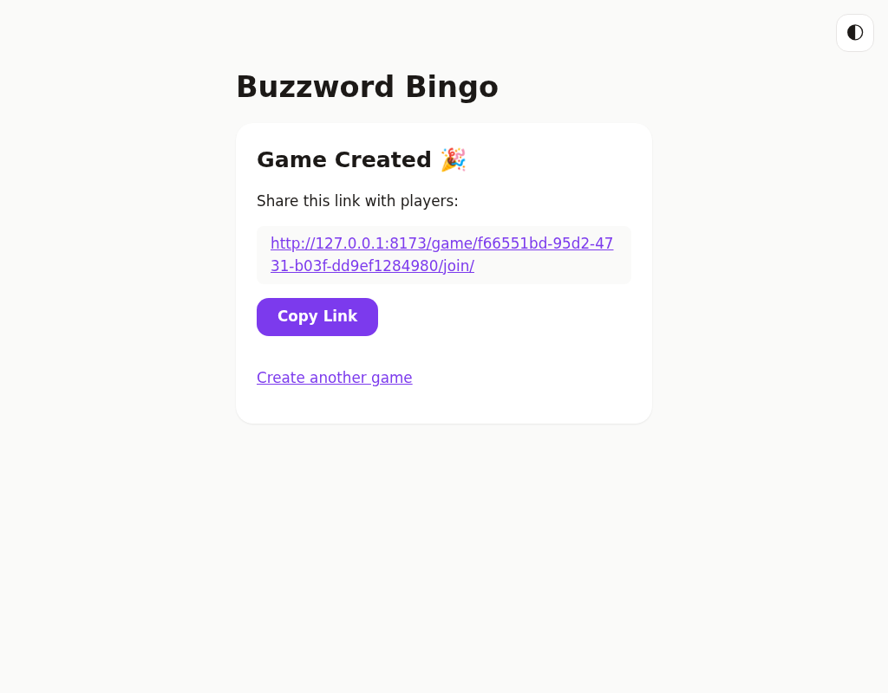

There's no waiting room — this screen is just a convenient place to grab the link and copy it again later if you need to.

## Joining a game

Anyone who opens the link sees the game's name and a field for their own name.
Like the home page, the name field is focused automatically and Enter submits the form.

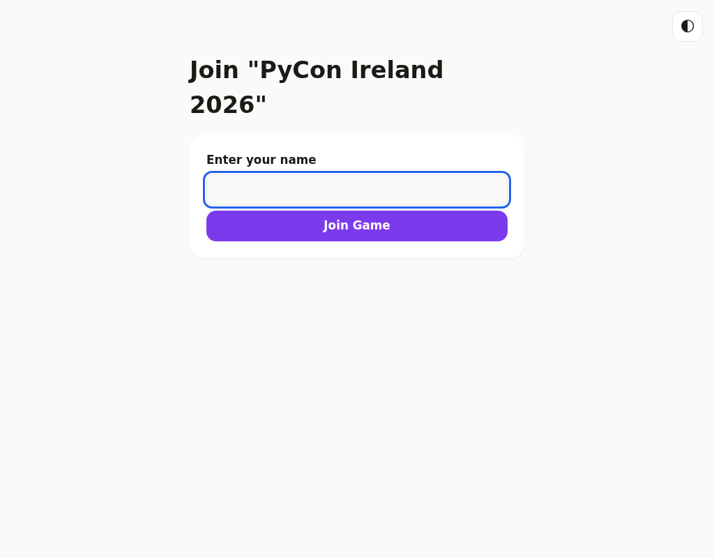

As soon as you join, you get your own randomly generated 5×5 board — every player's board has a different arrangement of buzzwords, so no two players play identically.

## Playing

Tap a square the moment you hear that buzzword said out loud.
It marks instantly — no waiting, no page reload.

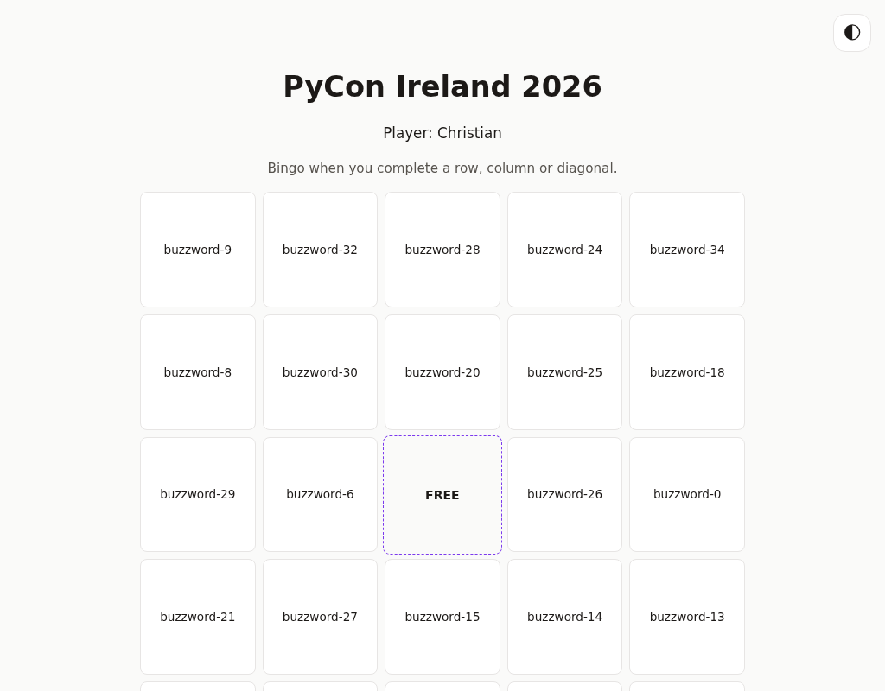

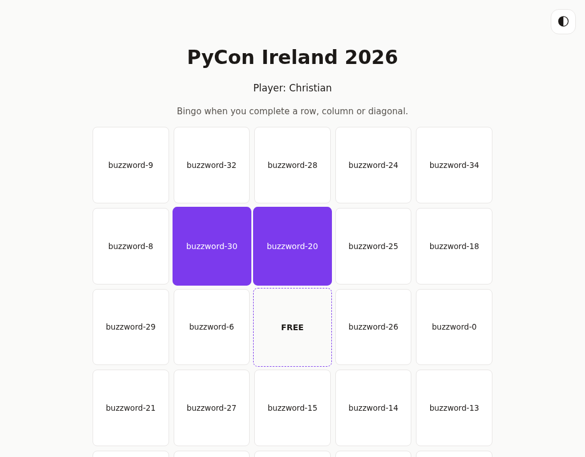

The center square is always a free space — it's already marked for you and can't be un-marked.

Tapped the wrong square?
Tap it again to unmark it.

## Winning

The moment you complete a full row, column, or diagonal, you'll see it immediately — an unmistakable celebration screen appears on your device only (other players don't see anything change on theirs until they next interact with the app).

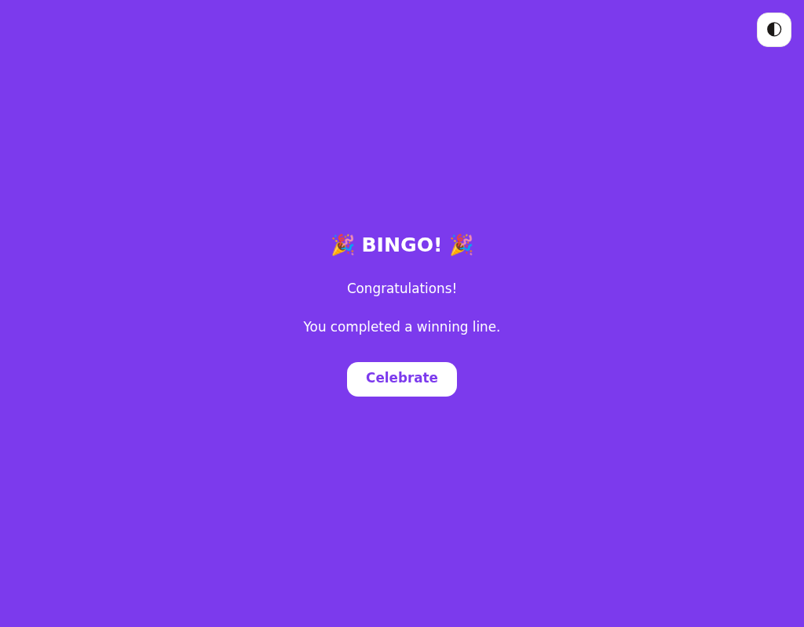

Tap **Celebrate** to dismiss the overlay and see your finished board underneath, with the winning line still highlighted in gold and every square now locked (no more marking or unmarking — the game is over).

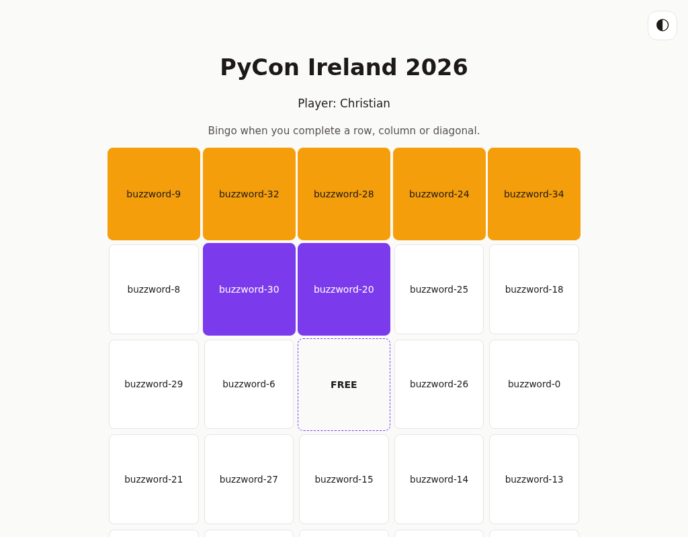

Everyone else's board becomes read-only too, and the next time they interact with the app they'll see a notice naming the winner.

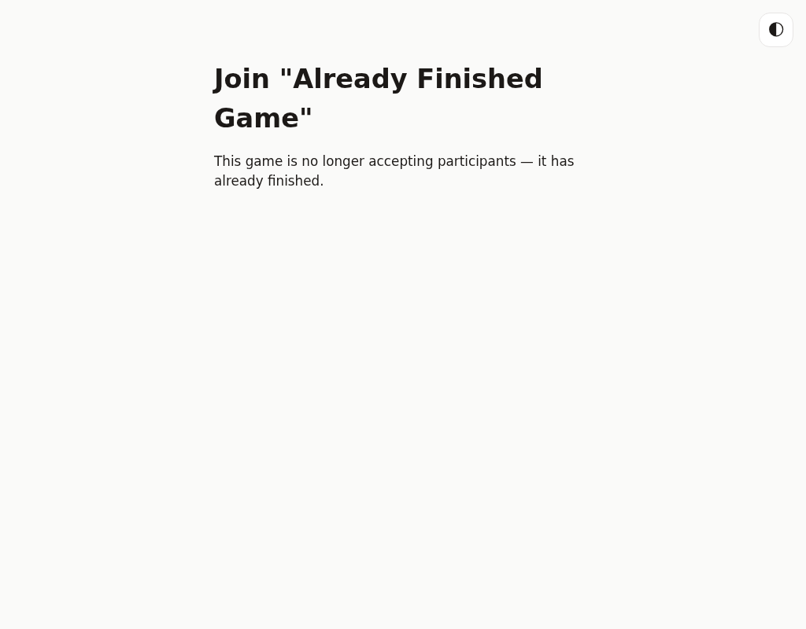

## Dark mode

There's a light/dark toggle in the top-right corner of every screen.
Your choice is remembered, so you won't need to set it again next time.

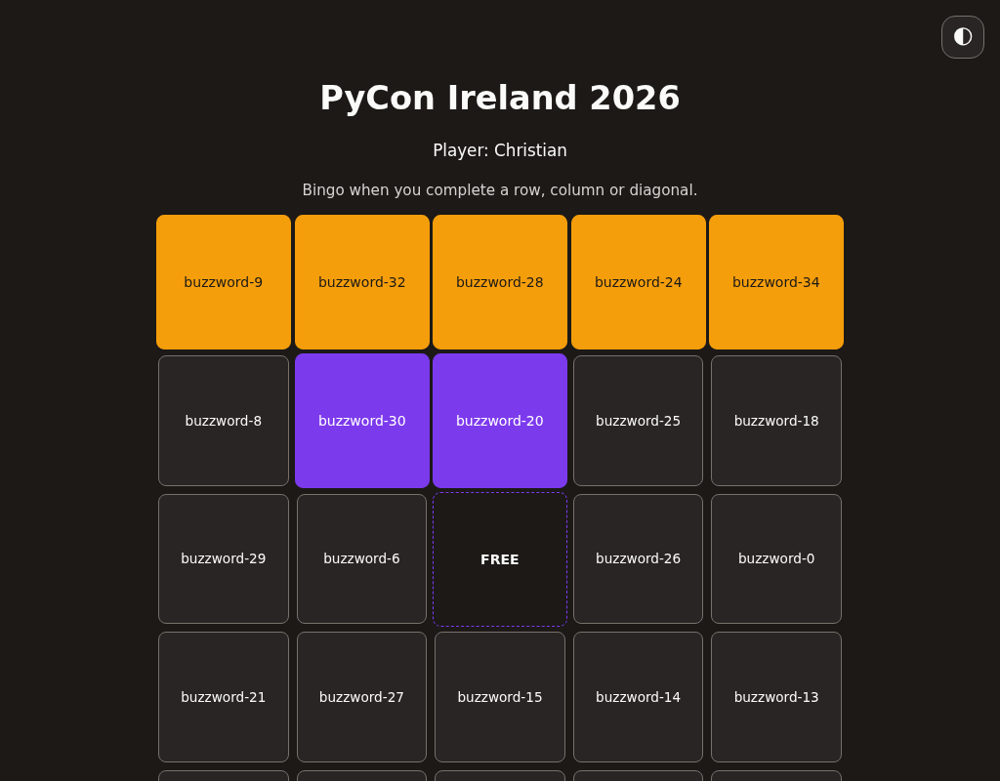

## On your phone

The whole game is designed mobile-first — one-handed, large touch targets, minimal typing.
It works the same way on a laptop, but this is the experience most players will actually have, phone in hand, mid-conference:

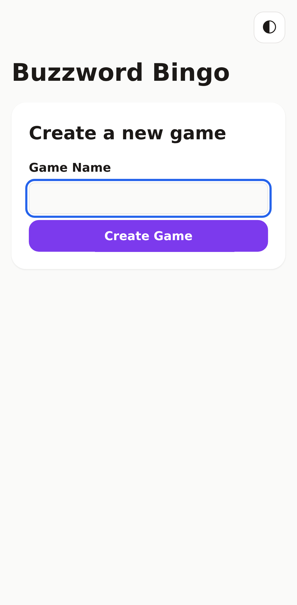

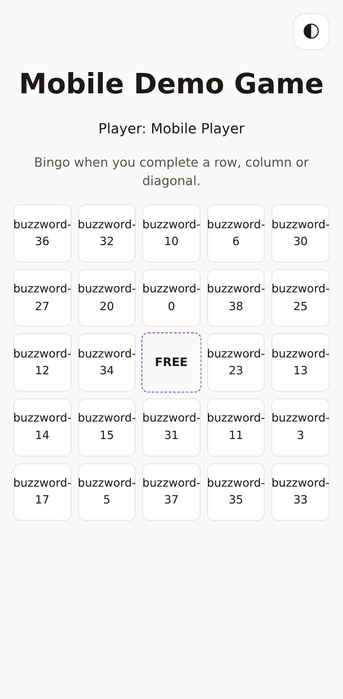

## When something's not right

A few things you might run into, and what they mean:

- **"Board not found" / "Game not found"** — the link is mistyped or out of
  date.

  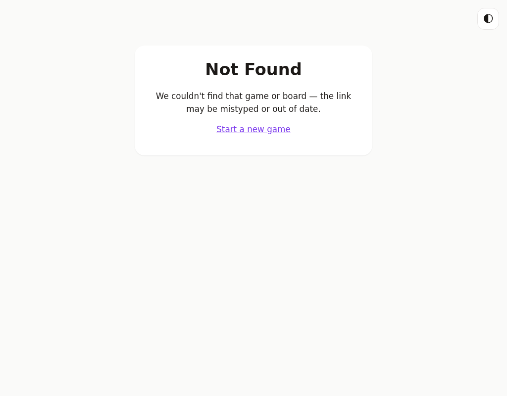
- **"This game is no longer accepting participants"** — the game already
  finished before you joined; ask the organizer for a new link.
- **"Not enough buzzwords are available"** — the organizer needs to configure
  more buzzwords before anyone can join (an admin-side setting, not something
  players can fix).

---

*For setup, architecture, and testing docs aimed at developers, see
[developer docs](frontend-ux.md).*
